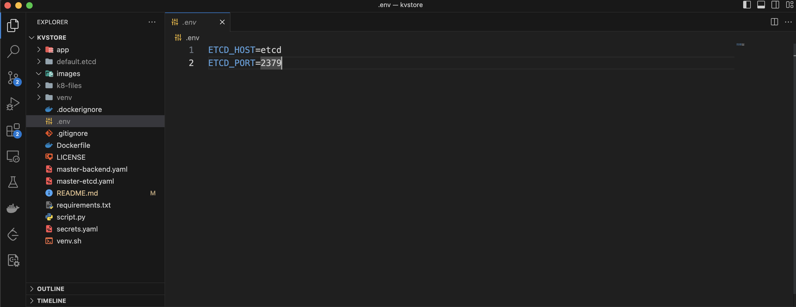

# KVstore

A Key-Value storage server using FastAPI, etcd and Kubernetes.


## Author

- [@jalayrupera](https://www.github.com/jalayrupera)


## Tech Stack

- Python
- FastAPI
- Docker version v20.10.23
- minikube v1.30.1


## Installation

Create .env file outside app folder. The env should contain field ETCD_HOST, ETCD_PORT.
Screenshot of env file



- Local Installation and run app
    1. In one terminal run command
    ```bash
      etcd
    ```
    2. In another terminal run following commands
    set ETCD_HOST=localhost, ETCD_PORT=2379 in .env file

    ```bash
      source venv.sh
      deactivate
      source venv/bin/activate
      export PROTOCOL_BUFFERS_PYTHON_IMPLEMENTATION=python
      uvicorn app.main:app --reload --reload-dir app --port 8000
    ``` 

- Kubernetes Deployments and services
    1. Run below command to start minikube, minikube dashboard and metrics-server
    ```bash
      minikube start
      minikube addons enable metrics-server
      minikube dashboard
    ```
    2. Run the below command to generate secrets for fastapi application pods. The ETCD_HOST and ETCD_PORT values should not be changed. It should same as below command.
    ```bash
      kubectl create secret generic etcd-secret --from-literal=ETCD_HOST=etcd --from-literal=ETCD_PORT=2379 --dry-run -o yaml > secrets.yaml
    ```
    3. Run the below commands to create deployment, service, HorizontalPodAutoScaler and volumes.
    ```bash
      kubectl apply -f=master-backend.yaml -f=master-etcd.yaml
      kubectl apply -f=secrets.yaml
    ``` 
    4. Expose the service on local machine
    ```bash
      minikube service backend
    ```
    